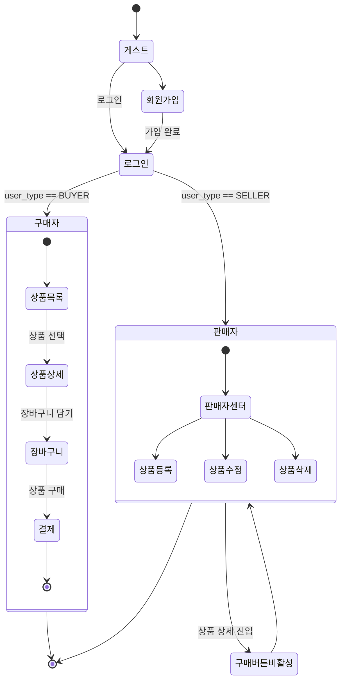

# 호두샵 (Open Market Service)

<a href="https://keemessle.github.io/open-market-service/" title="호두샵 프로젝트 페이지로 이동">
  
</a>

팀 프로젝트로 구현한 오픈마켓 서비스의 프론트엔드 레포지토리입니다. <br>
순수 HTML/CSS/JavaScript로 멀티 페이지 구조(MPA)로 제작했으며, <br>
공용 컴포넌트(`header`, `footer`, `modal`)와 페이지별 스크립트를 분리하여 유지보수성을 높였습니다. <br>
외부 공개 API를 사용해 상품 목록/상세/장바구니/회원 기능을 동작시키고, 판매자 권한으로 상품 등록과 대시보드를 제공합니다.

<br>

### 팀 구성 및 역할

#### 일억조 💸

|      이름      |                    역할                                               |
|  -----------  |  -----------------------------------------------------------------   | 
|      예슬      |  로그인, 회원가입 + 판매자 상품 등록 기능 및 UI 구현                            |
|      여훈      |  상품 상세 페이지 + 모달창 + 장바구니 기능 및 UI 구현                           |
|      민주      |  메인 페이지(상품 목록), GNB(Header) + 판매자 대시보드 기능 및 UI, 공통 CSS 작업  |

<br>

### 페이지 구조

- `index.html`: 메인(상품 목록 + 배너)
- `login.html`: 로그인
- `signup.html`: 회원가입(구매자/판매자 탭)
- `product-detail.html`: 상품 상세/수량 선택/장바구니 담기
- `cart.html`: 장바구니 목록/수량 증감/선택체크
- `make-product.html`: 판매자 상품 등록(이미지 미리보기 포함)
- `seller-center.html`: 판매자 대시보드(판매 상품 목록/탭/삭제 모달)
- `modal.html`: 공용 모달 템플릿
- `404.html`: 에러 페이지

<br>

### 요구사항 및 기능 명세


<br>

### 기술 스택

-  
  - 모듈화된 공통 스타일: `reset.css`, `variables.css`, `main.css`
- 
- REST API 연동: `https://api.wenivops.co.kr/services/open-market`

<br>

### 디렉토리 구조

```text
📦open-market-service
 ┣ 📂assets ➡️ 정적 리소스(폰트, 이미지)
 ┣ 📂src
 ┃ ┣ 📂components ➡️ 공용 컴포넌트(header, footer, modal)
 ┃ ┣ 📂pages ➡️ 페이지별 CSS/JS
 ┃ ┣ 📂services ➡️ 세션 및 인증 유틸(UserSession)
 ┃ ┗ 📂styles ➡️ 공통 CSS(reset, variable, main)
 ┣ 📜*.html ➡️ 라우트별 정적 페이지
 ┣ 📜.gitignore
 ┗ 📜README.md
```

<br>

## 주요 기능 요약

- **인증/회원**

  - 로그인(`src/pages/login/login.js`): 역할 탭(구매자/판매자) 선택 후 로그인, 결과의 `user_type` 검증, 성공 시 세션 저장 및 리다이렉트
  - 회원가입(`src/pages/signup/signup.js`): 아이디 중복확인, 비밀번호 규칙/재확인, 휴대폰 유효성, 약관 동의; 판매자 탭에서 사업자등록번호 인증 및 스토어명 입력 후 가입
  - 세션 관리(`src/services/UserSession.js`): 토큰/유저정보 저장, 만료 검증, 자동 토큰 재발급 및 만료 시 로그아웃 처리

- **상품/구매 플로우**

  - 메인 목록(`src/pages/index/index.js`): 상품 리스트 최신순 렌더링, 이미지 에러 대비, 커스텀 배너 스와이퍼/페이지네이션/반응형 리사이즈 처리
  - 상세 페이지(`src/pages/product-detail/product-detail.js`): 상세 정보/수량 증감/총액 계산/품절 처리/판매자 접근 시 버튼 비활성; 로그인 필요 시 공용 모달로 로그인 유도; 장바구니 담기 API 연동
  - 장바구니(`src/pages/cart/cart.js`): 서버 장바구니 목록 렌더링, 수량 증감에 따른 합계 업데이트(개별 행), 전체선택/해제, 개별 주문하기, 장바구니 삭제 API 연동

- **판매자 기능**

  - 상품 등록(`src/pages/make-product/make-product.js`): 권한 체크(판매자만), 폼 유효성 검사, 가격/배송비/재고 정수 포맷팅, 이미지 미리보기, FormData로 등록 API 호출
  - 대시보드(`src/pages/seller-center/seller-center.js`): 판매자 이름 기반 상품 목록 조회, 재고 상태 UI, 탭 인터랙션, 삭제 시 공용 모달 사용

- **공용 UI/UX**
  - 헤더/GNB(`src/components/header.js`): 로그인 상태/역할에 따라 액션 버튼 동적 구성(장바구니/마이페이지/판매자 센터), 비로그인 장바구니 접근 시 모달 안내, 드롭다운 위치 보정
  - 모달(`src/components/modal.js` + `modal.html`): 모달 템플릿 지연 로드, 외부/ESC/버튼 이벤트 처리, 콜백 실행 지원
  - 푸터(`src/components/footer.js`): 공용 푸터 로드

<br>

### API 기본 정보

- Base URL: `https://api.wenivops.co.kr/services/open-market`
- 주요 엔드포인트 예시
  - `GET /products` 목록, `GET /products/{id}` 상세
  - `POST /cart/` 담기, `GET /cart/` 조회, `DELETE /cart/{id}/` 삭제
  - `POST /accounts/login/` 로그인, `POST /accounts/{buyer|seller}/signup/` 회원가입
  - `POST /accounts/validate-username/` 아이디 중복 확인, `POST /accounts/seller/validate-registration-number/` 사업자등록번호 검증

<br>

### 인증/권한 테스트 팁

- 판매자 전용 페이지(`make-product.html`, `seller-center.html`)는 로그인 및 역할 검사를 통과해야 접근 가능합니다.
- 비로그인 사용자가 장바구니 또는 구매 액션을 시도하면 모달로 로그인 유도 후 로그인 페이지로 이동합니다.

### 접근성/성능 고려 사항

- 이미지 `loading="lazy"` 적용, `onerror`로 대체 이미지 처리
- 배너 스와이퍼는 클론 슬라이드로 루프 구현 및 리사이즈 시 트랜지션 비활성 처리로 깜빡임 최소화
- 키보드 ESC/외부 클릭으로 모달 닫힘 지원, 스크린 리더 대체 텍스트 제공

<br>

## 에러와 에러 해결

### 1. 글로벌 내비게이션바 (GNB)

#### 1-1. 로그인 상태별 액션 처리

- **문제:** 로그인 상태에 따라 액션 리스트와 기능이 달라야 함

- **해결:**
  - 상태별 액션 배열 생성 후 조건에 맞게 로드
  - 로그인 상태에 따라 각 기능(장바구니, 마이페이지 드롭다운, 로그아웃, 검색어 초기화)을 나누어 호출

```js
const actionsDefault = [actionCart, actionLogin];
const actionsLoggedIn = [actionCart, actionMypage];
const actionsLoggedInSeller = [actionMypage, actionSeller];

let role = !isLoggedIn
  ? "guest"
  : isBuyer
  ? "buyer"
  : isSeller
  ? "seller"
  : "guest";

if (isSellerCenter) {
  $header = createDOM(sellerHeaderHTML);
} else {
  $header = createDOM(defaultHeaderHTML);

  switch (role) {
    case "guest":
      loadActionsList(actionsDefault);
      resetSearchInput();
      setupCart();
      break;

    case "buyer":
      loadActionsList(actionsLoggedIn);
      resetSearchInput();
      setupCart();
      setupDropdown();
      setupLogout();
      break;

    case "seller":
      loadActionsList(actionsLoggedInSeller);
      resetSearchInput();
      setupDropdown();
      setupLogout();
      break;
  }
}
```

#### 1-2. 마이페이지 드롭박스 위치 조절

- **문제:** 화면이 작을 때 드롭박스가 화면 밖으로 나감

- **해결:**

  - JS에서 드롭박스 위치를 계산하여 화면 밖이면 `overflow` 클래스 추가
  - CSS에서 `overflow` 클래스가 적용되면 적절히 `left` 값이 조정됨
  - `resize` 이벤트 시마다 위치 조정


```js
function setDropdownPos() {
  const $mypageDropdown = document.querySelector(".dropdown-mypage");
  const dropdownRect = $mypageDropdown.getBoundingClientRect();
  const padding = dropdownRect.width / 2;
  if (dropdownRect.right > window.innerWidth - padding) {
    $mypageDropdown.classList.add("overflow");
  } else {
    $mypageDropdown.classList.remove("overflow");
  }
}

window.addEventListener("resize", () => {
  if (document.querySelector(".dropdown-mypage")) {
    setDropdownPos();
  }
});
```

### 2. 판매자 센터

#### 2-1. 스크롤바 영역 문제

- **문제:** 탭 패널 리스트에 스크롤바가 생길 때 리스트 헤드 영역과 위치가 맞지 않음

- **해결:** `scrollbar-gutter: stable`을 사용하여 헤드와 리스트 폭 일치


```css
.table-head {
  flex: 0 0 60px;
  height: 60px;
  overflow: auto;
  scrollbar-gutter: stable;
}
```

<br> 

## 프로젝트 회고 (한줄평)
- 민주
  - 신경 쓸 게 너무 많다..
  - 분업시 공통 요소를 관리하기 어렵다..
- 여훈 : HTML 구조 잡기와 CSS UI 구현이 많이 어려웠다...
- 예슬 : 로그인, 회원가입 로직은 상당히 까다롭다...

<br>

### 라이선스

이 레포지토리는 교육 목적의 팀 프로젝트 결과물로, 별도의 라이선스를 명시하지 않았습니다. 학습 및 포트폴리오 용도로 활용 가능합니다.

