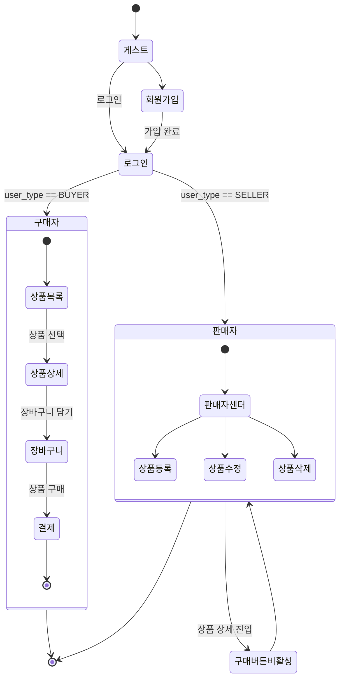

# 호두샵 (Open Market Service)

<a href="https://keemessle.github.io/open-market-service/" title="호두샵 프로젝트 페이지로 이동">
  
</a>

## 📑 목차

1. [프로젝트 개요](#1-프로젝트-개요)  
   - [목표](#목표)  
   - [기술 스택](#기술-스택)  
   - [팀 구성 및 역할](#팀-구성-및-역할)  

2. [API 및 배포 환경](#2-api-및-배포-환경)  
   - [배포 주소](#배포-주소)  
   - [테스트 계정](#테스트-계정)  
   - [API 기본 정보](#api-기본-정보)  

3. [디렉토리 구조](#3-디렉토리-구조)  
   - [프로젝트 폴더 구조](#프로젝트-폴더-구조)  
   - [페이지 구조](#페이지-구조)  

4. [요구사항 및 기능 명세](#4-요구사항-및-기능-명세)  

5. [주요 기능 요약](#5-주요-기능-요약)  
   - [인증/회원](#인증회원)  
   - [상품/구매 플로우](#상품구매-플로우)  
   - [판매자 기능](#판매자-기능)  
   - [공용 UIUX](#공용-uiux)  
   - [접근성/성능](#접근성-성능)  

6. [에러와 에러 해결](#6-에러와-에러-해결)
   - [글로벌 내비게이션바(GNB)](#1-글로벌-내비게이션바-gnb)   
   - [판매자 센터](#2-판매자-센터)
   - [배포서버 도메인 경로 문제](#3-배포서버-도메인-경로-문제)
   - [구매자-판매자 기능 공유 문제](#4-구매자-판매자-기능-공유-문제)
   - [회원가입](#5-회원가입)
   - [로그인](#6-로그인)

7. [프로젝트 회고 (한줄평)](#7-프로젝트-회고-한줄평)  

8. [라이선스](#8-라이선스)

<br>


## 1.🎯 프로젝트 개요

### 목표
- 순수 HTML/CSS/JavaScript로 멀티 페이지 구조(MPA)로 제작하였습니다.
- 공용 컴포넌트(`header`, `footer`, `modal`)와 페이지별 스크립트를 분리하여 유지보수성을 높였습니다.
- 외부 공개 API를 사용해 상품 목록/상세/장바구니/회원 기능을 동작시키고, 판매자 권한으로 상품 등록과 대시보드를 제공합니다.

<br>

### 기술 스택

-  
  - 모듈화된 공통 스타일: `reset.css`, `variables.css`, `main.css`
- 
- REST API 연동: `https://api.wenivops.co.kr/services/open-market`

<br>

### 팀 구성 및 역할

**팀명: 일억조 💸**

|      이름      |                    역할                                                |
|  -----------  |  -------------------------------------------------------------------  | 
|      예슬      |  로그인, 회원가입 + 판매자 상품 등록 기능 및 UI 구현                             |
|      여훈      |  상품 상세 페이지 + 모달창 + 장바구니 기능 및 UI 구현                            |
|      민주      |  메인 페이지(상품 목록), GNB(Header) + 판매자 대시보드 기능 및 UI, 공통 CSS 작업   |

<br>

## 2.🚀 API 및 배포 환경 정보

### 배포 주소
- [호두샵 서비스 바로가기](https://keemessle.github.io/open-market-service/)
### 테스트 계정
  ```markdown
    id: ahundredmillion1(구매자), ahundredmillion2(판매자)
    pw: weniv1234
  ```
### API 기본 정보
  - Base URL: `https://api.wenivops.co.kr/services/open-market`
  - 주요 엔드포인트 예시
    - `GET /products` 목록, `GET /products/{id}` 상세
    - `POST /cart/` 담기, `GET /cart/` 조회, `PUT /cart/{id}/` 수정, `DELETE /cart/{id}/` 삭제
    - `POST /accounts/login/` 로그인, `POST /accounts/{buyer|seller}/signup/` 회원가입
    - `POST /accounts/validate-username/` 아이디 중복 확인, `POST /accounts/seller/validate-registration-number/` 사업자등록번호 검증

<br>

## 3.🗂 디렉토리 구조

### 프로젝트 폴더 구조

> 주요 파일 및 폴더 구조
```
📂
├─ 404.html
├─ cart.html
├─ index.html
├─ login.html
├─ make-product.html
├─ modal.html
├─ product-detail.html
├─ seller-center.html
├─ signup.html
│
├─ assets (정적 리소스 - 폰트, 이미지)
│   ├─ fonts
│   └─ images
│       └─ icons
│
└─ src
    ├─ components (공용 컴포넌트)
    │   ├─ footer.js
    │   ├─ header.js
    │   └─ modal.js
    │
    ├─ pages (페이지별 CSS/JS)
    │   ├─ 404
    │   │   └─ 404.css
    │   │
    │   ├─ cart
    │   │   ├─ cart.css
    │   │   └─ cart.js
    │   │
    │   ├─ index
    │   │   ├─ index.css
    │   │   └─ index.js
    │   │
    │   ├─ login
    │   │   ├─ login.css
    │   │   └─ login.js
    │   │
    │   ├─ make-product
    │   │   ├─ make-product.css
    │   │   └─ make-product.js
    │   │
    │   ├─ product-detail
    │   │   ├─ product-detail.css
    │   │   └─ product-detail.js
    │   │
    │   ├─ seller-center
    │   │   ├─ seller-center.css
    │   │   └─ seller-center.js
    │   │
    │   └─ signup
    │       ├─ signup.css
    │       └─ signup.js
    │
    ├─ services (세션 및 인증 유틸)
    │   └─ UserSession.js
    │
    └─ styles (공통 CSS)
        ├─ main.css
        ├─ reset.css
        └─ variables.css
```

<br>

### 페이지 구조

- `index.html`: 메인(상품 목록 + 배너)
- `login.html`: 로그인
- `signup.html`: 회원가입(구매자/판매자 탭)
- `product-detail.html`: 상품 상세/수량 선택/장바구니 담기
- `cart.html`: 장바구니 목록/수량 증감/선택체크
- `make-product.html`: 판매자 상품 등록(이미지 미리보기 포함)
- `seller-center.html`: 판매자 대시보드(판매 상품 목록/탭/삭제 모달)
- `modal.html`: 공용 모달 템플릿
- `404.html`: 에러 페이지

<br>

## 4.📋 요구사항 및 기능 명세



#### 요약
- 게스트: 로그인 / 회원가입
- 구매자: 상품 → 장바구니 → 결제
- 판매자: 판매자센터 → 상품 CRUD, 상품 상세에서 구매 버튼 비활성화

<br>

## 5.🌟 주요 기능 요약

- **인증/회원**

  - 로그인(`src/pages/login/login.js`): 역할 탭(구매자/판매자) 선택 후 로그인, 결과의 `user_type` 검증, 성공 시 세션 저장 및 리다이렉트
  - 회원가입(`src/pages/signup/signup.js`): 아이디 중복확인, 비밀번호 규칙/재확인, 휴대폰 유효성, 약관 동의; 판매자 탭에서 사업자등록번호 인증 및 스토어명 입력 후 가입
  - 세션 관리(`src/services/UserSession.js`): 토큰/유저정보 저장, 만료 검증, 자동 토큰 재발급 및 만료 시 로그아웃 처리

- **상품/구매 플로우**

  - 메인 목록(`src/pages/index/index.js`): 상품 리스트 최신순 렌더링, 이미지 에러 대비, 커스텀 배너 스와이퍼/페이지네이션/반응형 리사이즈 처리
  - 상세 페이지(`src/pages/product-detail/product-detail.js`): 상세 정보/수량 증감/총액 계산/품절 처리/판매자 접근 시 버튼 비활성; 로그인 필요 시 공용 모달로 로그인 유도; 장바구니 담기 API 연동
  - 장바구니(`src/pages/cart/cart.js`): 서버 장바구니 목록 렌더링, 수량 증감에 따른 합계 업데이트, 전체선택/해제, 개별/전체 주문하기, 상품 수량 변경, 장바구니 삭제 API 연동

- **판매자 기능**

  - 상품 등록(`src/pages/make-product/make-product.js`): 권한 체크(판매자만), 폼 유효성 검사, 가격/배송비/재고 정수 포맷팅, 이미지 미리보기, FormData로 등록 API 호출
  - 대시보드(`src/pages/seller-center/seller-center.js`): 판매자 이름 기반 상품 목록 조회, 재고 상태 UI, 탭 인터랙션, 삭제 시 공용 모달 사용

- **공용 UI/UX**
  - 헤더/GNB(`src/components/header.js`): 로그인 상태/역할에 따라 액션 버튼 동적 구성(장바구니/마이페이지/판매자 센터), 비로그인 장바구니 접근 시 모달 안내, 드롭다운 위치 보정, 상품 검색 기능
  - 모달(`src/components/modal.js` + `modal.html`): 모달 템플릿 지연 로드, 외부/ESC/버튼 이벤트 처리, 콜백 실행 지원
  - 푸터(`src/components/footer.js`): 공용 푸터 로드

- **접근성/성능**
  - 이미지 `loading="lazy"` 적용, `onerror`로 대체 이미지 처리
  - 배너 스와이퍼는 클론 슬라이드로 루프 구현 및 리사이즈 시 트랜지션 비활성 처리로 깜빡임 최소화
  - 키보드 ESC/외부 클릭으로 모달 닫힘 지원, 스크린 리더 대체 텍스트 제공

<br>

## 6.🧯 에러와 에러 해결

### 1. 글로벌 내비게이션바 (GNB)

#### 1-1. 로그인 상태별 액션 처리

- **문제:** 로그인 상태에 따라 액션 리스트와 기능이 달라야 함

  

- **해결:**
  - 상태별 액션 배열 생성 후 조건에 맞게 로드
  - 로그인 상태에 따라 각 기능(장바구니, 마이페이지 드롭다운, 로그아웃, 검색어 초기화)을 나누어 호출

```js
const actionsDefault = [actionCart, actionLogin];
const actionsLoggedIn = [actionCart, actionMypage];
const actionsLoggedInSeller = [actionMypage, actionSeller];

let role = !isLoggedIn
  ? "guest"
  : isBuyer
  ? "buyer"
  : isSeller
  ? "seller"
  : "guest";

if (isSellerCenter) {
  $header = createDOM(sellerHeaderHTML);
} else {
  $header = createDOM(defaultHeaderHTML);

  switch (role) {
    case "guest":
      loadActionsList(actionsDefault);
      resetSearchInput();
      setupCart();
      break;

    case "buyer":
      loadActionsList(actionsLoggedIn);
      resetSearchInput();
      setupCart();
      setupDropdown();
      setupLogout();
      break;

    case "seller":
      loadActionsList(actionsLoggedInSeller);
      resetSearchInput();
      setupDropdown();
      setupLogout();
      break;
  }
}
```

#### 1-2. 마이페이지 드롭박스 위치 조절

- **문제:** 화면이 작을 때 드롭박스가 화면 밖으로 나감

- **해결:**

  - JS에서 드롭박스 위치를 계산하여 화면 밖이면 `overflow` 클래스 추가
  - CSS에서 `overflow` 클래스가 적용되면 적절히 `left` 값이 조정됨
  - `resize` 이벤트 시마다 위치 조정


```js
function setDropdownPos() {
  const $mypageDropdown = document.querySelector(".dropdown-mypage");
  const dropdownRect = $mypageDropdown.getBoundingClientRect();
  const padding = dropdownRect.width / 2;
  if (dropdownRect.right > window.innerWidth - padding) {
    $mypageDropdown.classList.add("overflow");
  } else {
    $mypageDropdown.classList.remove("overflow");
  }
}

window.addEventListener("resize", () => {
  if (document.querySelector(".dropdown-mypage")) {
    setDropdownPos();
  }
});
```

### 2. 판매자 센터

#### 2-1. 스크롤바 영역 문제

- **문제:** 탭 패널 리스트에 스크롤바가 생길 때 리스트 헤드 영역과 위치가 맞지 않음

- **해결:** `scrollbar-gutter: stable`을 사용하여 헤드와 리스트 폭 일치


```css
.table-head {
  flex: 0 0 60px;
  height: 60px;
  overflow: auto;
  scrollbar-gutter: stable;
}
```

<br>

### 3. 배포서버 도메인 경로 문제
#### 3-1. 오류 정의
 - 배포 후 페이지 이동 시 404 에러가 빈번하게 발생하여 사용자가 정상적으로 서비스를 이용할 수 없는 상황

#### 3-2. 정보 수집
 - 로컬 환경: http://localhost/ (루트 경로가 프로젝트 최상위)
 - 배포 환경: https://keemessle.github.io/open-market-service/ (서브 디렉토리 구조)
 - 에러 패턴: 특정 페이지에서 다른 페이지로 이동할 때 404 에러 발생
 - 로컬에서는 문제없이 동작: 동일한 코드가 로컬에서는 정상 작동

#### 3-3. 발생 원인
```js // 문제가 되는 코드 패턴
    window.location.href = "../login.html";  // 상대경로를 상위폴더로 적음.
```

 - 분석 결과:
   - 로컬: ../product-detail.html → http://localhost/product-detail.html
   - 배포: ../product-detail.html → https://keemessle.github.io/product-detail.html 
   - 실제 경로: https://keemessle.github.io/open-market-service/product-detail.html

#### 3-4. 문제 해결 방안
```js // 상대경로로 변경
    window.location.href = "./login.html";  // 현재 디렉토리 기준
```

 - 결과: 당장의 문제 해결

#### 3-5. 차후 적용 방안
```js // 환경별 기준 경로 설정
    const BASE_PATH = window.location.hostname === 'localhost' ? '/' : '/open-market-service/';
    // 페이지 이동 예시
    window.location.href = BASE_PATH + 'login.html';
```

 - 예상 결과 : 서브 디렉토리 상대경로 오타 등 자잘한 문제가 생길 가능성도 배제할 수 있음.

#### 3-6. 학습 포인트
 - 배포 환경과 로컬 환경의 차이점 이해: 경로 구조가 다를 수 있음을 항상 고려
 - 환경별 설정 분리: 개발/배포 환경에 따른 동적 경로 설정을 하여 근본적인 원인을 차단할 것.


### 4. 구매자-판매자 기능 공유 문제
#### 4-1. 오류 정의
 - 구매자 페이지의 검색 기능을 추가했더니 판매자센터에서 JavaScript 에러가 발생하여 판매자가 대시보드를 이용할 수 없는 상황

#### 4-2. 정보 수집
 - 공통 헤더 컴포넌트: 검색 기능이 포함된 헤더를 구매자/판매자 페이지에서 공유
 - 페이지별 헤더 구조 차이:

 - 구매자 페이지/판매자 페이지: 검색바 포함된 헤더 존재
 - 판매자센터: 검색바가 없는 간소화된 헤더

 - 에러 발생 패턴: 판매자센터 접속 시 콘솔에 JavaScript 에러 발생
 - 기능 영향도: 에러로 인해 판매자센터의 다른 기능들도 동작하지 않음

#### 4-3. 발생 원인
 - id가 form-search인 컴포넌트가 판매자센터에서는 없음

```js 모든 페이지에서 실행되는 공통 스크립트
    document.getElementById("form-search").addEventListener("submit", async (e) => {
        // 검색 처리
    });
```

 - 에러 분석: TypeError: Cannot read property 'addEventListener' of null
 - 원인: getElementById가 null을 반환했는데 addEventListener를 호출
 - 발생 위치: 판매자센터 페이지 (검색 요소가 존재하지 않음)

#### 4-4. 문제 해결 방안
 - 방안 1: "요소 존재 여부를 확인하면 될 것이다"

```js
    if(document.getElementById("form-search")){
        document.getElementById("form-search").addEventListener("submit", async (e) => {
        // 검색처리
    }
```

 - 결과: 당장 에러는 해결되지만 id 중복 문제 우려 됨.

 - 방안 2: "URL 패턴 기반으로 조건부 실행한다."

``` js 현재 적용 방법
    if(!window.location.pathname.includes("seller-center") &&
        !window.location.pathname.includes("make-product")){
        // 검색 처리
    }
```

 - - 결과: 에러와 id 중복문제는 해결되지만, 예외 url이 늘어날수록 관리가 어렵고 코드가 복잡해짐

#### 4-5. 차후 적용 방안
```js 설정 파일로 페이지 타입 관리
    const PAGE_CONFIG = {
    buyer: {
        paths: ['/', '/product-detail/', '/cart/', ...],
        features: ['search', 'cart', ...]
    },
    seller: {
        paths: ['/seller-center/', '/make-product/', ...],
        features: [....]
    }
    };
```

 - 예상 결과 : 페이지타입을 설정 파일에서 관리하여, 코드가 단순하고 확장성이 늘어남.

#### 4-6. 학습 포인트
 - 공통 컴포넌트의 조건부 실행: 모든 페이지에서 동일한 요소가 존재한다고 가정하면 안됨
 - URL 기반 페이지 타입 판단: 페이지별 다른 동작이 필요할 때 효과적인 패턴
 - 방어적 프로그래밍: null 체크와 예외 처리의 중요성
 - 확장성 고려: 새로운 페이지 타입이 추가되어도 쉽게 대응할 수 있는 구조

<br>

### 5. 회원가입
#### 5-1. 가입하기 버튼 활성화
- **문제**: 모든 입력을 다 했는데도 가입 버튼이 활성화되지 않음
- **원인**:
  - 단순히 input 값만 검사하면, 아이디 중복확인/사업자등록번호 인증 등 서버 검증이 완료되지 않아도 버튼이 활성화될 수 있음.  
  - 반대로, 검증이 완료됐는데도 input 값만 바뀌면 상태가 꼬여서 버튼이 활성화되는 경우도 있었음.
- **해결**:
  - 서버 검증이 필요한 항목(아이디, 사업자등록번호 등)은 별도의 상태 변수(isIdChecked, validatedId, isBizChecked, validatedBiz 등)로 검증 완료 여부와 실제 인증된 값을 관리하도록 구조를 변경.  
  - 버튼 활성화 조건에 이 상태 변수들을 반드시 포함시켜 **검증이 완료된 경우에만** 버튼이 활성화되도록 개선함.
```js
    let isIdChecked = false; // 아이디 중복 검사 체크 여부 
    let validatedId = null; // 현재 입력된 값이 중복 검사를 한 값과 같은지 

    function updateFormValidation() {
    let isFormValid =
        username &&
        pw &&
        pwc &&
        name &&
        $phone1.value &&
        $phone2.value &&
        $phone3.value &&
        isIdChecked &&
        username === validatedId &&
        isValidPassword(pw) &&
        pw === pwc &&
        PHONE_PATTERN.test(phoneNum) &&
        isAgree;
    ));
```
    
#### 5-2. 현재 필드 이전 필드 입력 검사
- **문제**: 다음 필드 입력 시 에러 메시지가 출력되지 않는다거나 빈 값들이 많을 때, 첫 번째 필드에만 에러 메시지가 발생
- **원인**: 각 input의 유효성 검증이 해당 필드만 검사해서 이전 필드가 비어 있어도 다음 필드 입력이 가능했음.
- **해결**: 
  - 입력 필드의 순서를 배열로 관리하고, checkPreviousFields 함수를 도입해 현재 필드 이전의 모든 필드가 올바르게 입력됐는지 반복문을 돌려 검사하도록 개선함.
  -  현재 필드 이전의 모든 필드가 올바르게 입력됐는지 allPrevFilled 변수로 체크하고, 하나라도 비어 있으면 false로 설정.
  - 마지막에 allPrevFilled 값을 return하여 이후 검증 로직에서 이전 필드가 모두 입력된 경우에만 다음 검증을 진행하도록 제어함.
```js
    const BUYER_FIELD_ORDER = [
      $idInput,
      $passwordInput,
      $passwordConfirmInput,
      $nameInput,
      $phone1,
    ];

    // ... (생략)

    for (let i = 0; i < currentFieldIndex; i++) {
        const $previousField = fieldOrder[i];
        if (!isFieldFilled($previousField)) {
          showMessage($previousField, VALIDATION_ERROR.REQUIRED);
          allPrevFilled = false;
        }
      }
      return allPrevFilled;
```
#### 5-3. 경로 문제

### 6. 로그인
#### 6-1. 로그인 성공 후 “이전 페이지로” 이동 실패
- **문제**:
  - history.back()과 window.location.reload()를 함께 사용했더니 이전 페이지로 이동하지 않거나, 새로고침이 반복되거나, 원치 않는 동작이 발생함.
  - location.replace(document.referrer)로 이동했더니 회원가입 → 로그인 → 회원가입 화면으로 돌아감
- **원인**:
  - 두 코드를 연달아 쓰면이전 페이지로 이동하자마자 다시 현재 페이지가 새로고침되어 히스토리 이동이 제대로 동작하지 않거나, 무한 새로고침 루프에 빠질 수 있음.
  - 회원가입 후 로그인 시, referrer가 signup.html이어서 다시 회원가입 페이지로 이동하는 문제가 발생함.
- **해결**:
  - referrer 또는 메인 페이지로 명확히 이동하도록 location.replace(document.referrer)로 수정
  - includes("login.html") 뿐 아니라 includes("signup.html")도 함께 체크
```js
  // 이전 화면으로 돌아가기
    if (
      document.referrer &&
      !document.referrer.includes("login.html") &&
      !document.referrer.includes("signup.html")
    ) {
      location.replace(document.referrer);
    } else {
      location.replace("./index.html");
    }
```


<br> 

## 8.🗣️ 프로젝트 회고 (한줄평)
> **민주**: "*신경 쓸 게 너무 많고 분업시 공통 요소를 관리하기 어렵다*..."<br>

> **여훈**: "*HTML 구조 잡기와 CSS UI 구현이 많이 어려웠다...js는 생각했던 그대로.*"<br>

> **예슬**: "*로그인, 회원가입 로직은 상당히 까다롭다*..." <br>

<br>

## 9.📜 라이선스

이 레포지토리는 교육 목적의 팀 프로젝트 결과물로, 별도의 라이선스를 명시하지 않았습니다. 학습 및 포트폴리오 용도로 활용 가능합니다.

